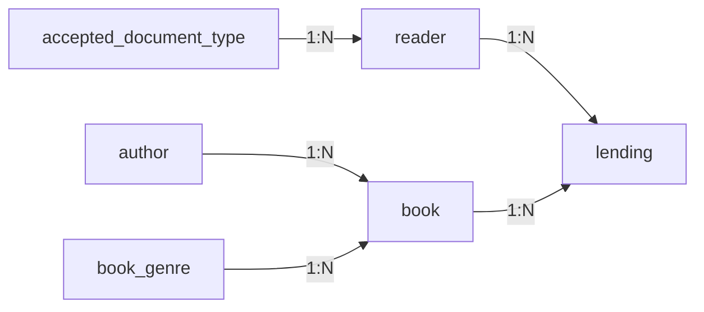

# Database

## Descrição

Este banco de dados foi projetado para um sistema de gerenciamento de biblioteca.

Seu objetivo é armazenar informações sobre:

- Livros;
- Autores;
- Gêneros literários;
- Leitores;
- Tipos de documentos aceitos;
- Empréstimos de livros.

O modelo foi desenvolvido priorizando simplicidade, integridade dos dados e facilidade de expansão futura.

---

# Visualização

---

# Tabelas e Colunas

## author

| Key | Nome | Tipo | NULL | UNIQUE |
|-----|------|------|------|--------|
| PK | id | INTEGER | ❌ | ✅ |
| | name | VARCHAR(50) | ❌ | ❌ |

---

## book

| Key | Nome | Tipo | NULL | UNIQUE |
|-----|------|------|------|--------|
| PK | id | INTEGER | ❌ | ✅ |
| | title | VARCHAR(100) | ❌ | ❌ |
| | release_date | DATE | ❌ | ❌ |
| FK | author_id | INTEGER | ❌ | ❌ |
| FK | genre_id | INTEGER | ❌ | ❌ |

---

## book_genre

| Key | Nome | Tipo | NULL | UNIQUE |
|-----|------|------|------|--------|
| PK | id | INTEGER | ❌ | ✅ |
| | genre | VARCHAR(20) | ❌ | ❌ |

---

## accepted_document_type

| Key | Nome | Tipo | NULL | UNIQUE |
|-----|------|------|------|--------|
| PK | id | INTEGER | ❌ | ✅ |
| | document_type_name | VARCHAR(30) | ❌ | ❌ |

---

## reader

| Key | Nome | Tipo | NULL | UNIQUE |
|-----|------|------|------|--------|
| PK | id | INTEGER | ❌ | ✅ |
| | first_name | VARCHAR(50) | ❌ | ❌ |
| | last_name | VARCHAR(50) | ❌ | ❌ |
| | email | VARCHAR(100) | ✅ | ✅ |
| | phone_number | VARCHAR(20) | ✅ | ❌ |
| | birthday | DATE | ❌ | ❌ |
| FK | document_type_id | INTEGER | ❌ | ❌ |
| | document_identification | CHAR(30) | ❌ | ✅ |

---

## lending

| Key | Nome | Tipo | NULL | UNIQUE |
|-----|------|------|------|--------|
| PK | id | INTEGER | ❌ | ✅ |
| FK | reader_id | INTEGER | ❌ | ❌ |
| FK | book_id | INTEGER | ❌ | ❌ |
| | lending_date | DATE | ❌ | ❌ |
| | expected_return_date | DATE | ❌ | ❌ |
| | return_date | DATE | ✅ | ❌ |

---

# Convenções

- Todas as tabelas utilizam nomes em **snake_case**.
- Todas as chaves primárias utilizam a coluna `id`.
- Chaves estrangeiras utilizam o padrão `<tabela>_id`.
- Todos os campos obrigatórios são definidos como **NOT NULL**, exceto:
  - `reader.email`
  - `reader.phone_number`
  - `lending.return_date`
- Os campos `reader.email` e `reader.document_identification` possuem restrição **UNIQUE**.
- As datas utilizam o tipo `DATE`.
- Os identificadores de documentos utilizam `CHAR`, preservando zeros à esquerda e permitindo diferentes formatos de documentos.

